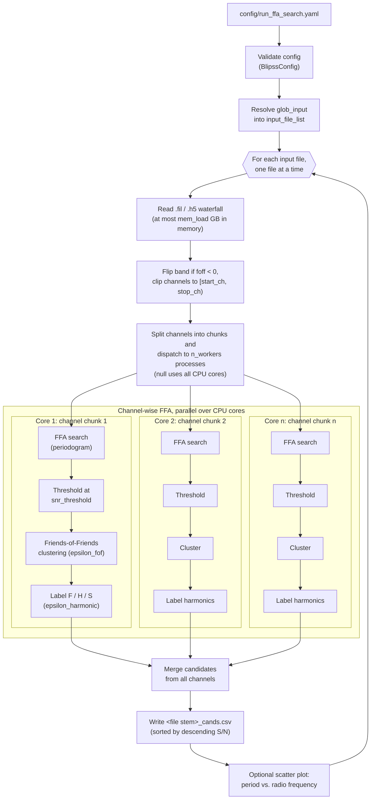

# BLIPSS
[](https://doi.org/10.3847/1538-3881/acccf0)
[](https://arxiv.org/abs/2305.18527)
[](https://github.com/UCBerkeleySETI/blipss/blob/main/LICENSE)
[](https://github.com/UCBerkeleySETI/blipss/actions/workflows/main.yml)

The Breakthrough Listen Investigation for Periodic Spectral Signals (BLIPSS) targets the detection of narrowband periodic radar transmissions from potential technologically advanced alien life forms residing in the Universe. See this [link](http://www.mobileradar.org/radar_descptn_3.html) for examples of historic terrestrial radar operating at different radio frequencies.

BLIPSS utilizes the Fast Folding Algorithm (FFA) in [`riptide-ffa`](https://github.com/v-morello/riptide) to search for channel-wide periodic signals in radio dynamic spectra.

## Citation

If using ``blipss`` contributes to a scientific publication, please cite the article:
[Suresh et al., <i>"A 4&ndash;8 GHz Galactic Center Search for Periodic Technosignatures"</i>. 2023 AJ 165 255](https://ui.adsabs.harvard.edu/abs/2023arXiv230518527S/abstract).

---

## Table of Contents
- [Installation](#installation)
    - [Option 1: Using a uv environment (recommended)](#a-using-uv-recommended)
    - [Option 2: Using a conda environment](#b-using-a-conda-environment)
    - [Add-on: Enabling LaTeX in Plots](#enabling-latex-in-plots)
- [Repository Organization](#organization)
- [Functionalities and Usage](#usage)
    - [run-ffa-search](#run-ffa-search)
    - [compare_cands.py (pending refactor)](#comparecands)
    - [plot_cands.py (pending refactor)](#plotcands)
    - [compute-phase-resolved-ds](#compute-phase-resolved-ds)
    - [inject-signal](#inject-signal)
    - [simulate-data](#simulate-data)
- [Troubleshooting](#troubleshooting)

## Installation <a name="installation"></a>

Choose one of the two installation methods below.

### A. Using uv (Recommended)

The installation steps below assume that you have [uv](https://docs.astral.sh/uv/getting-started/installation/) and [git](https://git-scm.com/downloads) installed on your local machine.

1. Clone the repository to your local machine.
```bash
git clone git@github.com:UCBerkeleySETI/blipss.git
```

2. Navigate into the repository and install the package.
```bash
cd blipss
make install
```

3. Verify that the installation is complete by checking that all unit tests pass locally.
```bash
make test
```

4. Activate the created uv environment.
```bash
source .venv/bin/activate
```
Your uv environment is now ready for use.

### B. Using a conda environment

The installation steps below assume that you have [Anaconda](https://www.anaconda.com/download) and [git](https://git-scm.com/downloads) installed on your local machine.

1. Create a conda environment with Python 3.12.
```bash
conda create -n blipss-env python=3.12
```

2. Activate the conda environment.
```bash
conda activate blipss-env
```

3. Install `pybind11`, a prerequisite for [`riptide-ffa`](https://github.com/v-morello/riptide).
```bash
pip install pybind11
```

4. Clone the repository to your local machine.
```bash
git clone git@github.com:UCBerkeleySETI/blipss.git
```

5. Navigate into the repository and install the full package.
```bash
cd blipss
pip install .
```
Your conda environment is now ready for use.

### Enabling LaTeX in Plots

BLIPSS plotting modules expose a boolean `use_latex` flag that, when set to `True`, renders axis labels and annotations using LaTeX. Enabling this flag requires that a LaTeX distribution be installed on your system.

Install a LaTeX distribution appropriate for your operating system.
- **macOS**: [MacTeX](https://www.tug.org/mactex/)
- **Linux**: [TeX Live](https://www.tug.org/texlive/) via your package manager (e.g., `sudo apt install texlive-full`)
- **Windows**: [MiKTeX](https://miktex.org/)

Also, ensure `dvipng` and `ghostscript` are available, as matplotlib requires them for LaTeX rendering.
```bash
# macOS (Homebrew)
brew install ghostscript

# Debian/Ubuntu
sudo apt install dvipng ghostscript
```

If you do not have a LaTeX distribution installed, leave `use_latex=False` (the default behavior). Matplotlib will use its built-in math renderer and plots will still be generated without error.

## Repository Organization <a name="organization"></a>

```
blipss/                            # repository root
├── blipss/                        # Python package
│   ├── cli/                       # CLI entry points (installed as console scripts)
│   ├── core/                      # FFA period-finding and harmonic detection algorithms
│   ├── io/                        # Data I/O: filterbank/HDF5 reading, YAML config parsing, filterbank writing
│   ├── models/                    # Pydantic data models
│   ├── plotting/                  # Plotting utilities
│   ├── utils/                     # General utilities
│   └── constants.py
├── config/                        # Sample YAML configuration files, one per CLI command
├── tests/                         # Test suite mirroring the blipss/ package layout
├── pyproject.toml
└── README.md
```

Each CLI command reads its parameters from a companion YAML file in `config/`. For example:
```bash
simulate-data --config config/simulate_data.yaml
```

## Functionalities and Usage <a name="usage"></a>
The BLIPSS package contains six executable scripts, which are:
1. ``run-ffa-search``: <a name="run-ffa-search"></a>
Execute a channel-wise FFA period search on a set of input data files (`.fil` or `.h5`), flag harmonics of detected periods, and write one .csv file of candidates per input file.

Input files are processed sequentially, one at a time, so that memory usage stays bounded by the `mem_load` cap. Within a file, the FFA search over spectral channels is embarrassingly parallel and is distributed across CPU cores as contiguous chunks of channels. Here is a schematic of the `run-ffa-search` workflow.



Reads search parameters from a YAML config file. Key configuration sections:
- `input`: data directory, glob pattern (or an explicit `input_file_list`) for selecting `.fil` or `.h5` files, and optional `start_ch` / `stop_ch` index bounds for restricting the channel range
- `output`: output directory for the per-file .csv candidate lists (defaults to `data_dir`)
- `plotting`: `do_plot` flag, list of plot formats (defaults to `['.png']`), and `use_latex` flag
- `ffa_search`: trial period range (`min_period`, `max_period`), `fpmin`, `snr_threshold`, phase-bin range (`bins_min`, `bins_max`), `ducy_max`, optional running-median detrending (`do_deredden`, `rmed_width`), and clustering tolerances (`epsilon_fof`, `epsilon_harmonic`)
- `resources`: maximum data volume (GB) to load into memory and `n_workers` parallel worker processes for the channel-wise search (`null` uses all available CPUs)

Columns in each output .csv file are 'Channel', 'Radio frequency (MHz)', 'Bins', 'Best width', 'Period (s)', 'S/N', and 'Harmonic flag'.

Execution syntax:
```
run-ffa-search --config config/run_ffa_search.yaml 2>&1 | tee <Log file>
```

---
2. ``compare_cands.py``: <a name="comparecands"></a>
**Pending refactor.** This script has not yet been ported to the `blipss` package's CLI (see [`run-ffa-search`](#run-ffa-search) for an example of the target structure); `executables/compare_cands.py` no longer exists, so the usage below does not currently work.

Compare periodicity detections across a set of <em>N</em> .csv files generated by ``run-ffa-search``. For every unique candidate period, an <em>N</em>-digit binary code is generated, wherein ones and zeros represent detections and non-detections respectively.<br>

Note that the order of input .csv files passed to ``compare_cands.py`` matters. When read from left to right, the <em>i</em>-th place of the <em>N</em>-digit binary code refers to the <em>i</em>-th .csv file in the input list.<br>

The output from ``compare_cands.py`` is a single .csv file containing the following columns.<br>
'Channel', 'Radio frequency (MHz)', 'Bins', 'Best width', 'Period (s)', 'S/N', 'Code' <br>

Execution syntax from repo base folder (pre-refactor):
```
python executables/compare_cands.py -i config/compare_cands.cfg | tee <Log file>
```

---
3. ``plot_cands.py``: <a name="plotcands"></a>
**Pending refactor.** This script has not yet been ported to the `blipss` package's CLI (see [`run-ffa-search`](#run-ffa-search) for an example of the target structure); `executables/plot_cands.py` no longer exists, so the usage below does not currently work.

Produce verification plots for a chosen subset of candidates. <br>

Here's a sample plot of a candidate with period 30 s and code 101010. Each row represents a different data file. The left column shows periodograms derived from different data files. We indicate the candidate period by red dashed vertical lines in the left panels. The right column illustrates average pulse profiles and pulse stacks in the phase-time plane. <br>


Clearly, we see significant spikes at the expected candidate period in the periodograms on the first, third, and fifth rows. <br>

Execution syntax from repo base folder (pre-refactor):
```
python executables/plot_cands.py -i config/plot_cands.cfg | tee <Log file>
```

---
4. ``compute-phase-resolved-ds``: <a name="compute-phase-resolved-ds"></a>
Fold each spectral channel of a filterbank file at a given period and produce a grayscale phase-resolved dynamic spectrum plot.

Here's a sample output showing a phase-resolved spectrum of pulsar B0355+54.


Reads folding parameters from a YAML config file. Key configuration sections:
- `input_data`: name of the filterbank file to load (`.fil` or `.h5`) and its parent directory
- `output`: output plot basename, list of plot formats (defaults to `['.png']`), output directory (defaults to `data_dir`), and `use_latex` flag
- `channel_selection`: `start_ch` and `stop_ch` index bounds for restricting the channel range (both optional)
- `phase_folding_parameters`: folding `period` (s), number of phase `bins`, optional running-median detrending (`do_deredden`, `rmed_width`)
- `resource_limits`: maximum data volume (GB) to load into memory and number of parallel worker processes for folding

Execution syntax:
```
compute-phase-resolved-ds --config config/compute_phase_resolved_ds.yaml 2>&1 | tee <Log file>
```

---
5. ``inject-signal``: <a name="inject-signal"></a>
Inject one or more channel-wide periodic signals into a real-world filterbank data file. Each injected pulse train has a boxcar single-pulse shape and a constant amplitude calibrated to the local per-channel noise statistics.

Reads injection parameters from a YAML config file. Key configuration sections:
- `input_data`: name of the filterbank file to load (`.fil` or `.h5`) and its parent directory
- `output`: output basename, file extension (defaults to match the input format), and output directory (defaults to the input directory)
- `periodic_signal_injection`: lists of channels, periods (s), duty cycles, pulse peak S/N values, and initial phases for each injected signal
- `resource_limits`: maximum data volume (GB) allowed to be loaded into memory at once

Execution syntax:
```
inject-signal --config config/inject_signal.yaml 2>&1 | tee <Log file>
```

---
6. ``simulate-data``: <a name="simulate-data"></a>
Build an artificial filterbank file with one or more channel-wide periodic signals superposed on a Gaussian white noise background. Injected signals have boxcar single-pulse shapes and a constant pulse amplitude.

Reads simulation parameters from a YAML config file. Key configuration sections:
- `output`: basename and output directory for the generated `.fil` file
- `simulation_properties`: number of samples and channels, sampling time, channel bandwidth, first channel frequency, and random seed
- `periodic_signal_injection`: lists of channels, periods (s), duty cycles, pulse S/N values, and initial phases for each injected signal
- `optional_header_parameters`: metadata fields (e.g., source name, start MJD) written into the filterbank header

Execution syntax:
```
simulate-data --config config/simulate_data.yaml 2>&1 | tee <Log file>
```

## Troubleshooting <a name="troubleshooting"></a>
Please submit an issue to voice any problems or requests.

Improvements to the code are always welcome. Check out [CONTRIBUTING.md](https://github.com/UCBerkeleySETI/blipss/blob/main/CONTRIBUTING.md) for best practices on how to contribute to this repository.
